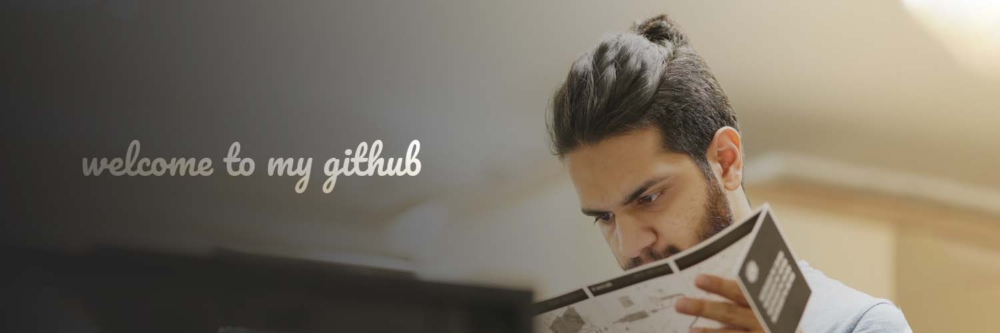

# 👋 I'm Mahdi Karimi
## 📚 I am a full-time learner
I study computer engineering at Nooshirvani Institute of technology. I love building computers, tinkering around with open-source hardware like Arduino as well as contributing to open-source software. Learning never stops, neither does my endeavour for getting better at my craft.

## 💻 I do web and software development
I'm highly interested in front-end web development and have more than two years of experience working with HTML5, CSS3 libraries such tailwindCSS, bootstrap and Bulma, VueJs and NuxtJs. I am also familiar with RESTful API design, databases, nginx and other back-end and DevOps concepts.
I enjoy writing tutorials and articles on my free time to help others learn what I know. I usually post them up on virgool.io. chcek them out.

## ✏️ I write articles and tutorials
I enjoy writing tutorials and articles on my free time to help others learn what I know. I usually post them up on virgool.io. chcek them out.
